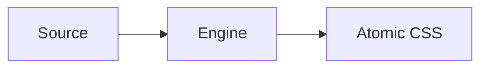

# Markdown Authoring

Use this reference for VitePress-specific Markdown features and syntax patterns. Use [writing-conventions.md](./writing-conventions.md) for page metadata, prose style, and link policy.

## Custom containers

```md
::: info
Informational callout.
:::

::: tip
Helpful tip.
:::

::: warning
Warning about potential issues.
:::

::: danger
Critical warning.
:::

::: details Click to expand
Collapsed content.
:::
```

Set a custom title by appending text after the type: `::: danger STOP`. Add `{open}` to make a details block open by default.

## GitHub-Flavored alerts

```md
> [!NOTE]
> Highlights information users should be aware of.

> [!TIP]
> Optional advice.

> [!IMPORTANT]
> Crucial information.

> [!WARNING]
> Demands immediate attention.

> [!CAUTION]
> Negative consequences of an action.
```

## Code block annotations

Line highlighting by number:

````md
```ts{1,4,6-8}
// lines 1, 4, 6–8 are highlighted
```
````

Inline annotations append as comments:

| Annotation | Effect |
|---|---|
| `// [!code highlight]` | Highlight the line |
| `// [!code focus]` | Focus the line and blur others |
| `// [!code ++]` | Show as added |
| `// [!code --]` | Show as removed |
| `// [!code warning]` | Yellow warning highlight |
| `// [!code error]` | Red error highlight |

Line numbers: append `:line-numbers` or `:line-numbers=N` to the opening fence.

## Code groups with group icons

Use `::: code-group` with `vitepress-plugin-group-icons` for tabbed code blocks:

````md
::: code-group

```ts [vite.config.ts]
import { defineConfig } from 'vite'
```

```js [vite.config.js]
module.exports = { }
```

:::
````

## Twoslash

For TypeScript code blocks with hover type info, use the `twoslash` meta:

````md
```ts twoslash
import { pika } from '@pikacss/core'
const styles = pika({ color: 'red' })
//    ^?
```
````

Twoslash uses `@shikijs/vitepress-twoslash`. Hover annotations show inferred types inline.

## Mermaid diagrams

Use `mermaid` for diagrams:

````md

````

## Import code snippets

Import from a file relative to the source root (`@` = project root):

```md
<<< @/snippets/example.ts
<<< @/snippets/example.ts{2,4-6}
<<< @/snippets/example.ts#region-name{1,3 ts:line-numbers}
```

## Markdown file inclusion

```md
<!--@include: ./parts/shared-section.md-->
<!--@include: ./parts/shared-section.md{3,}-->
<!--@include: ./parts/shared-section.md#section-id-->
```

## Custom heading anchors

```md
## My Section {#custom-anchor-id}
```

## Vue in Markdown

VitePress compiles Markdown as Vue SFCs. You can use:

- `<script setup>` blocks for imports and reactive state.
- `{{ expression }}` interpolation in prose.
- Vue components (import locally or register globally).
- `<style module>` for scoped styles.

Escape Vue interpolation with `v-pre`:

```md
::: v-pre
{{ this is displayed literally }}
:::
```