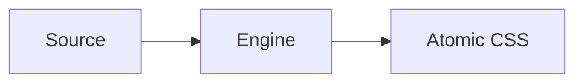

# Writing Guidelines

Consolidated authoring rules for PikaCSS documentation pages. Use alongside `content-architecture.md` for the page structure spec.

## Frontmatter

Every page except the home page must include the PikaCSS custom frontmatter fields:

```yaml
---
title: Page Title
description: Concise one-line description (used by llms.txt and search)
relatedPackages:
  - '@pikacss/core'
relatedSources:
  - 'packages/core/src/engine.ts'
category: getting-started
order: 10
---
```

Required fields:

| Field | Purpose |
|---|---|
| `title` | Page heading and nav label |
| `description` | Concise summary for search and LLM contexts |
| `relatedPackages` | Package names this page documents |
| `relatedSources` | Source files that are the ground truth for page content |
| `category` | Section ownership — must match one of the valid categories below |
| `order` | Sort order within the section sidebar |

Valid `category` values: `getting-started`, `integrations`, `customizations`, `official-plugins`, `plugin-development`, `api`, `troubleshooting`.

VitePress built-in frontmatter options are also available: `titleTemplate`, `head`, `layout` (`doc` | `home` | `page`), `outline`, `sidebar`, `navbar`, `aside`, `lastUpdated`, `editLink`, `footer`, `pageClass`.

Non-index pages are never exempt from the required fields above. If a page is not an `index.md` file, treat any missing required metadata field as a bug. Index pages may have page-specific or generator-owned exceptions, but do not generalize those exceptions to neighboring pages.

### Choosing `relatedSources`

Use the smallest set of current source files that fully backs the documented behavior:

- Point to the exact implementation or type files that define the behavior, not only broad package entry points or barrels.
- When documenting concrete CSS variable names, defaults, or preset lists, include the file that declares those values.
- When documenting integration-specific options or build behavior, include the file that defines the public option shape and the file that implements the behavior if they differ.
- Remove stale paths when the implementation moves. `relatedSources` should match the current source tree, not historical locations.

## Writing Style

- Use clear, direct language and address the reader as "you".
- Keep paragraphs short and use lists or tables when the structure is clearer than prose.
- Start each page with a one-sentence summary of what it covers.
- Use `##` for major sections and `###` for subsections. Never skip heading levels.
- Keep headings concise and descriptive in sentence case.
- Prefer active voice and avoid filler phrasing.
- Use PikaCSS terms consistently. Do not introduce alternate names for engine concepts.
- Keep API names, config keys, import paths, CSS variable names, and similar identifiers exactly aligned with source and JSDoc. Do not normalize, shorten, pluralize, or alias them in prose or examples.

## Internal Links

- Use absolute internal links: `[Setup](/getting-started/setup)`.
- Never use relative Markdown links such as `../integrations/unplugin.md`.
- Link to headings with anchors when needed: `[Layers](/customizations/layers)`.

## Cross-Page Linking Strategy

Prefer links in this priority order:

1. **Section-local progression** — the next page in the same section.
2. **Section transfer** — only when the reader's next action changes section.
3. **API reference lookup** — when exact symbols or options matter.
4. **Troubleshooting off-ramp** — when failure or confusion is likely.

Rules:

- Section-local links should be stronger and more visible than cross-section links.
- Cross-section links should only appear when the reader's next action genuinely changes section.
- API reference links are for exact lookup, not as the default next step from instructional pages.
- If a page crosses into plugin authoring, API lookup, or troubleshooting, state why.
- Do not build circular link lists that bounce readers between sections without a task change.

## Page Endings

Every page must end with a `## Next` section.

- `## Next` should normally contain 2–4 links.
- At least one link should stay within the current section unless the page is intentionally terminal.
- Most instructional pages should include no more than one cross-section link in `## Next`.
- API reference pages may use `## Next` to point to one owning guide page and one neighboring reference page.

## VitePress Markdown Syntax

### Custom Containers

```md
::: info
Informational callout.
:::

::: tip
Helpful tip.
:::

::: warning
Warning about potential issues.
:::

::: danger
Critical warning.
:::

::: details Click to expand
Collapsed content.
:::
```

Set a custom title by appending text: `::: danger STOP`. Add `{open}` for default-open details blocks.

### GitHub-Flavored Alerts

```md
> [!NOTE]
> Highlights information users should be aware of.

> [!TIP]
> Optional advice.

> [!WARNING]
> Demands immediate attention.
```

### Code Block Annotations

Line highlighting by number:

````md
```ts{1,4,6-8}
// lines 1, 4, 6–8 are highlighted
```
````

Inline annotations:

| Annotation | Effect |
|---|---|
| `// [!code highlight]` | Highlight the line |
| `// [!code focus]` | Focus the line and blur others |
| `// [!code ++]` | Show as added |
| `// [!code --]` | Show as removed |
| `// [!code warning]` | Yellow warning highlight |
| `// [!code error]` | Red error highlight |

Line numbers: append `:line-numbers` or `:line-numbers=N` to the opening fence.

### Code Groups

Use `::: code-group` with `vitepress-plugin-group-icons` for tabbed code blocks:

````md
::: code-group

```ts [vite.config.ts]
import { defineConfig } from 'vite'
```

```js [vite.config.js]
module.exports = { }
```

:::
````

### Twoslash

For TypeScript code blocks with hover type info:

````md
```ts twoslash
import { pika } from '@pikacss/core'
const styles = pika({ color: 'red' })
//    ^?
```
````

### Mermaid Diagrams

````md

````

### Import Code Snippets

```md
<<< @/.examples/<section>/<name>.example.ts
<<< @/.examples/<section>/<name>.example.ts{2,4-6}
```

### Custom Heading Anchors

```md
## My Section {#custom-anchor-id}
```

## Content Quality Rules

### No `## Intro` Heading

Customization and Official Plugin pages must not use `## Intro` as a heading. Present the introductory content as an opening paragraph directly after the H1, then continue with `## Config`, `## Examples`, etc.

### Collection Config Entry Naming

When documenting collection-style plugin options, use the canonical `definitions` entry name (for example, `selectors: { definitions: [...] }`, `shortcuts: { definitions: [...] }`, and `keyframes: { definitions: [...] }`). Do not teach or preserve duplicated nested names in examples or explanatory callouts.

### Content Duplication Prohibition

Do not repeat the same code example or code-group verbatim across sections of the same page. If two sections reference the same concept, show the example in one place and link to it from the other. Replace duplicate code-groups with a brief summary and a link: `See [Section Name](#anchor) above.`

### API Completeness Check

When documenting a function with multiple variants (e.g., `pika()`, `pika.str()`, `pika.arr()`, `pikap()`), document all variants in a single dedicated section. Do not leave variants discoverable only through generated type files.

### Public API Shape Fidelity

Examples, config snippets, and schema tables must use supported public shapes from the exported API. Do not substitute convenient containers or helper patterns that the public type does not accept.

- If a public value is `Arrayable<T>`, examples may show `value` or `[value]`; do not use `new Set([...])` or other iterables.
- Prefer exported identity helpers and public config namespaces when they are the documented entry point.
- When in doubt, read the owning type or JSDoc before writing the snippet.

### Behavior Claim Scoping

Scope behavior claims to the exact integration, option, or code path that guarantees them.

- Do not imply an automatic behavior in the general case unless the source guarantees it across all supported integrations.
- Name the condition when behavior depends on an option or wrapper package, such as `@pikacss/nuxt`, `autoCreateConfig`, or a generated-file setting.
- Prefer precise phrasing such as "The Nuxt module auto-imports..." or "When `autoCreateConfig` is true..." over unqualified statements like "PikaCSS automatically...".

### Integration Mechanism Fidelity

When a wrapper package performs setup on behalf of another integration, document both the wrapper and the concrete mechanism rather than only the final effect.

- If a wrapper registers another plugin internally, name that plugin explicitly when it matters to setup guidance.
- If CSS is imported via a generated plugin or template, say that directly rather than implying a broad automatic import behavior.
- If manual setup would duplicate the wrapper behavior, warn the reader not to do both.

### Literal Ordering Claims

When docs describe CSS ordering with a concrete layer weight or priority, include the literal value from source.

- If the implementation sets a layer to `-1`, document `-1` instead of only saying "earlier" or "before other layers".
- Distinguish "before the default layers" from "before every layer" unless the source guarantees the stronger claim.

### Cross-Page Example Naming Consistency

Generic placeholder names should stay aligned across related pages so the examples read like one coherent plugin walkthrough.

- If one page defines `myPlugin()`, related pages should keep using `myPlugin()` for config, augmentation, and test examples unless they explicitly introduce a second plugin.
- Keep placeholder config keys aligned with the same example plugin name. Do not rename the factory in one page and leave the augmented config key behind.

### Custom Container Usage

Use VitePress custom containers to surface non-obvious behavior:

- `:::tip` — for design rationale or "why" explanations the reader may wonder about.
- `:::warning` — for constraints that cause silent failures if violated (e.g., static analyzability).
- `:::info` — for supplemental context that is useful but not critical.

Do not overuse containers. Reserve them for genuinely surprising or frequently misunderstood behavior.

## API Docs Ownership

- `docs/api/index.md` is a hand-authored overview page.
- Package-level API pages under `docs/api/*.md` (other than `index.md`) are **generator-owned** by `gen-api-docs` and must not be manually edited.
- Generated pages carry an auto-generated marker comment.
- The generator emits one page per published package.
- When JSDoc is incomplete, the generator reports missing symbol coverage explicitly rather than silently omitting symbols.

## Sidebar and Nav

- `docs/.vitepress/sidebarAndNav.ts` is the single source of truth for sidebar groups and nav items.
- Sidebar entries must align with pages declared in `content-architecture.md`.
- Treat the current top-level nav shape in `sidebarAndNav.ts` as authoritative. Do not assume a fixed two-link navbar; preserve the existing grouping unless the task intentionally changes the docs information architecture.
- When a page is added or removed, update `sidebarAndNav.ts` to keep it in sync.

## Example Authoring

### File Structure

```text
docs/.examples/<section>/
├── <name>.example.ts              # non-engine example (config, etc.)
├── <name>.example.pikain.ts       # engine input — real user code
├── <name>.example.pikaout.css     # rendered output (generated by test)
└── <name>.example.test.ts         # test that produces the pikaout snapshot
docs/.examples/_utils/
└── pika-example.ts                # shared test utility — DO NOT MODIFY
```

Unless an API or tool requires a canonical filename, treat example file paths and generated output paths as illustrative. Use realistic paths, but do not imply that a specific filename is mandatory when it is not.

### Test Utility — `_utils/pika-example.ts`

This file provides `renderExampleCSS()` and `readExampleFile()`. It uses `createCtx` from `@pikacss/integration` to simulate the real build pipeline: source code is fed through `ctx.transform()` exactly as the unplugin would process it. **Do not replace this with `createEngine` / `engine.use()` — that bypasses the transform/extract pipeline and produces incorrect results.**

### Engine Examples (pikain/pikaout pattern)

Any example demonstrating `pika()` or engine behavior uses the `pikain` / `pikaout` pattern:

- `.example.pikain.ts` — **must contain real user code using `pika({...})`** as a bare global function call, exactly as a user would write in their project. Do not import from `@pikacss/core` in pikain files. Do not use `defineStyleDefinition` or other internal helpers.
- `.example.pikaout.css` — rendered CSS output, generated by the test (never hand-written).
- `.example.test.ts` — reads the pikain file with `readExampleFile()`, passes the source string to `renderExampleCSS()`, and snapshots the result with `toMatchFileSnapshot()`.

Example pikain file:

```ts
// docs/.examples/getting-started/basic.example.pikain.ts
const className = pika({
  color: 'red',
  fontSize: '16px',
})
```

Example test file:

```ts
// docs/.examples/getting-started/basic.example.test.ts
import { it } from 'vitest'
import { readExampleFile, renderExampleCSS } from '../_utils/pika-example'

it('basic example output matches engine', async ({ expect }) => {
  const usage = await readExampleFile(new URL('./basic.example.pikain.ts', import.meta.url))
  const css = await renderExampleCSS({ usageCode: usage })
  await expect(css).toMatchFileSnapshot('./basic.example.pikaout.css')
})
```

When the example needs a custom engine config (e.g. `important`, `layers`, `selectors`), pass it via the `config` option:

```ts
const css = await renderExampleCSS({
  config: { important: true },
  usageCode: usage,
})
```

Use `renderScope` to control output scope: `'atomic-only'` (default), `'full'` (layer declaration + preflights + atomic), or `'preflights-and-atomic'`.

Display in Markdown with `::: code-group`:

````md
::: code-group

<<< @/.examples/<section>/<name>.example.pikain.ts [Input]

<<< @/.examples/<section>/<name>.example.pikaout.css [Output]

:::
````

### Non-Engine Examples

Standard single-file pattern — no `pikain` / `pikaout` companions needed:

```md
<<< @/.examples/<section>/<name>.example.ts
```

### Install Command Code Groups

Always provide `pnpm`, `npm`, and `yarn` variants:

````md
::: code-group

```sh [pnpm]
pnpm add @pikacss/core
```

```sh [npm]
npm install @pikacss/core
```

```sh [yarn]
yarn add @pikacss/core
```

:::
````

### General Rules

- Use `docs/.examples/_utils/pika-example.ts` for the `renderExampleCSS()` helper in tests.
- All example tests run under `pnpm --filter @pikacss/docs test`.
- Use `<<< @/.examples/...` imports for runnable or behavior-sensitive examples, especially when the docs need to prove engine output, config behavior, or generated-file semantics.
- Treat imported examples as validated through docs-scoped checks: `.example.test.ts` files run under Vitest, while imported example files without dedicated tests are still covered by `pnpm --filter @pikacss/docs typecheck`.
- Inline fenced code is acceptable for signatures, module augmentations, compact config skeletons, helper call patterns, or other source-backed snippets where a dedicated fixture would add little validation value.
- A page may legitimately have zero `<<<` imports when its examples are primarily explanatory or reference-oriented rather than test-backed behavior demos.

## Quality Checklist

Use this checklist as the final gate before handoff.

### Page Identity

- The docs path matches the expected location from `content-architecture.md`.
- The page title matches the section intent and does not drift into a neighboring topic.

### Metadata

- All required frontmatter fields are present on every non-index page.
- `category` matches the section ownership.
- `relatedSources` point to the exact current source files that back the page behavior.
- `description` is concise and can stand alone in search contexts.

### Content

- The page fulfills its template purpose.
- Every heading from the template is present.
- The page does not absorb topics that belong to other pages.
- Behavior claims about integrations, generated files, or automatic behavior are scoped to the exact guarantee in source.

### Examples

- Example mechanics follow the rules above.
- Engine examples use `pikain` / `pikaout` pattern.
- Snippets and config examples use valid public shapes from exported types.
- Pages that omit examples justify the omission.

### Linking

- Cross-page linking follows the priority order above.
- `## Next` is present and follows the rules above.
- The strongest next step is not hidden only in inline prose.

### Validation

- Run the smallest credible docs validation for the changed area.
- Changed claims, examples, and `relatedSources` were checked against the owning source files.
- Example tests pass when `.example.test.ts` coverage exists for the changed example.
- Docs typecheck passes when imported example files or docs-driven example imports were added or changed.
- Generated API pages were regenerated (not hand-edited) when API reference content changed.
- Nav/sidebar entries match the current page set.

### Generated API Page Exceptions

- Generated API pages follow frontmatter, `## Next`, and linking rules.
- Generated API pages may use generator-provided content instead of hand-authored prose.
- If a generated page needs special handling, update the generator or its inputs instead of patching the output.

## Package README Conventions

Each package README follows this structure:

```markdown
# @pikacss/<name>

<one-line description>

## Installation

<package manager install commands>

## Usage

<minimal working example>

## Documentation

See the [full documentation](https://pikacss.com/<current-docs-route>).

## License

MIT
```

Point the documentation link at the package's current public docs page, following the live section routes such as `https://pikacss.com/integrations/unplugin`, `https://pikacss.com/official-plugins/reset`, `https://pikacss.com/getting-started/eslint-config`, or `https://pikacss.com/api/core` for low-level packages that are primarily documented through the API reference. Do not keep historical legacy guide URLs. Update the affected `packages/*/README.md` when a package's public API or behavior changes. Ensure the usage example still compiles.
