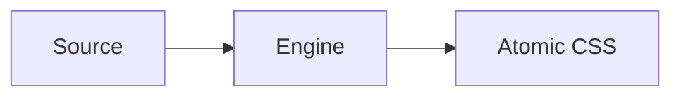

# Writing Guidelines

Consolidated authoring rules for PikaCSS documentation pages. Use alongside `content-architecture.md` for the page structure spec.

## Frontmatter

Every page except the home page must include the PikaCSS custom frontmatter fields:

```yaml
---
title: Page Title
description: Concise one-line description (used by llms.txt and search)
relatedPackages:
  - '@pikacss/core'
relatedSources:
  - 'packages/core/src/engine.ts'
category: getting-started
order: 10
---
```

Required fields:

| Field | Purpose |
|---|---|
| `title` | Page heading and nav label |
| `description` | Concise summary for search and LLM contexts |
| `relatedPackages` | Package names this page documents |
| `relatedSources` | Source files that are the ground truth for page content |
| `category` | Section ownership — must match one of the valid categories below |
| `order` | Sort order within the section sidebar |

Valid `category` values: `getting-started`, `integrations`, `customizations`, `official-plugins`, `plugin-development`, `api`, `troubleshooting`.

VitePress built-in frontmatter options are also available: `titleTemplate`, `head`, `layout` (`doc` | `home` | `page`), `outline`, `sidebar`, `navbar`, `aside`, `lastUpdated`, `editLink`, `footer`, `pageClass`.

## Writing Style

- Use clear, direct language and address the reader as "you".
- Keep paragraphs short and use lists or tables when the structure is clearer than prose.
- Start each page with a one-sentence summary of what it covers.
- Use `##` for major sections and `###` for subsections. Never skip heading levels.
- Keep headings concise and descriptive in sentence case.
- Prefer active voice and avoid filler phrasing.
- Use PikaCSS terms consistently. Do not introduce alternate names for engine concepts.

## Internal Links

- Use absolute internal links: `[Installation](/getting-started/installation)`.
- Never use relative Markdown links such as `../guide/config.md`.
- Link to headings with anchors when needed: `[Layers](/customizations/layers)`.

## Cross-Page Linking Strategy

Prefer links in this priority order:

1. **Section-local progression** — the next page in the same section.
2. **Section transfer** — only when the reader's next action changes section.
3. **API reference lookup** — when exact symbols or options matter.
4. **Troubleshooting off-ramp** — when failure or confusion is likely.

Rules:

- Section-local links should be stronger and more visible than cross-section links.
- Cross-section links should only appear when the reader's next action genuinely changes section.
- API reference links are for exact lookup, not as the default next step from instructional pages.
- If a page crosses into plugin authoring, API lookup, or troubleshooting, state why.
- Do not build circular link lists that bounce readers between sections without a task change.

## Page Endings

Every page must end with a `## Next` section.

- `## Next` should normally contain 2–4 links.
- At least one link should stay within the current section unless the page is intentionally terminal.
- Most instructional pages should include no more than one cross-section link in `## Next`.
- API reference pages may use `## Next` to point to one owning guide page and one neighboring reference page.

## VitePress Markdown Syntax

### Custom Containers

```md
::: info
Informational callout.
:::

::: tip
Helpful tip.
:::

::: warning
Warning about potential issues.
:::

::: danger
Critical warning.
:::

::: details Click to expand
Collapsed content.
:::
```

Set a custom title by appending text: `::: danger STOP`. Add `{open}` for default-open details blocks.

### GitHub-Flavored Alerts

```md
> [!NOTE]
> Highlights information users should be aware of.

> [!TIP]
> Optional advice.

> [!WARNING]
> Demands immediate attention.
```

### Code Block Annotations

Line highlighting by number:

````md
```ts{1,4,6-8}
// lines 1, 4, 6–8 are highlighted
```
````

Inline annotations:

| Annotation | Effect |
|---|---|
| `// [!code highlight]` | Highlight the line |
| `// [!code focus]` | Focus the line and blur others |
| `// [!code ++]` | Show as added |
| `// [!code --]` | Show as removed |
| `// [!code warning]` | Yellow warning highlight |
| `// [!code error]` | Red error highlight |

Line numbers: append `:line-numbers` or `:line-numbers=N` to the opening fence.

### Code Groups

Use `::: code-group` with `vitepress-plugin-group-icons` for tabbed code blocks:

````md
::: code-group

```ts [vite.config.ts]
import { defineConfig } from 'vite'
```

```js [vite.config.js]
module.exports = { }
```

:::
````

### Twoslash

For TypeScript code blocks with hover type info:

````md
```ts twoslash
import { pika } from '@pikacss/core'
const styles = pika({ color: 'red' })
//    ^?
```
````

### Mermaid Diagrams

````md

````

### Import Code Snippets

```md
<<< @/.examples/<section>/<name>.example.ts
<<< @/.examples/<section>/<name>.example.ts{2,4-6}
```

### Custom Heading Anchors

```md
## My Section {#custom-anchor-id}
```

## Content Quality Rules

### No `## Intro` Heading

Customization and Official Plugin pages must not use `## Intro` as a heading. Present the introductory content as an opening paragraph directly after the H1, then continue with `## Config`, `## Examples`, etc.

### Double-Layer Config Key Annotation

When a plugin's config uses a double-layer key structure (e.g., `selectors: { selectors: [...] }`), add a `:::tip Why the nested key?` container explaining that the outer key is the plugin configuration namespace from type augmentation and the inner key is the actual option. This prevents reader confusion about apparent redundancy.

### Content Duplication Prohibition

Do not repeat the same code example or code-group verbatim across sections of the same page. If two sections reference the same concept, show the example in one place and link to it from the other. Replace duplicate code-groups with a brief summary and a link: `See [Section Name](#anchor) above.`

### API Completeness Check

When documenting a function with multiple variants (e.g., `pika()`, `pika.str()`, `pika.arr()`, `pikap()`), document all variants in a single dedicated section. Do not leave variants discoverable only through generated type files.

### Custom Container Usage

Use VitePress custom containers to surface non-obvious behavior:

- `:::tip` — for design rationale or "why" explanations the reader may wonder about.
- `:::warning` — for constraints that cause silent failures if violated (e.g., static analyzability).
- `:::info` — for supplemental context that is useful but not critical.

Do not overuse containers. Reserve them for genuinely surprising or frequently misunderstood behavior.

## API Docs Ownership

- `docs/api/index.md` is a hand-authored overview page.
- Package-level API pages under `docs/api/*.md` (other than `index.md`) are **generator-owned** by `gen-api-docs` and must not be manually edited.
- Generated pages carry an auto-generated marker comment.
- The generator emits one page per published package.
- When JSDoc is incomplete, the generator reports missing symbol coverage explicitly rather than silently omitting symbols.

## Sidebar and Nav

- `docs/.vitepress/sidebarAndNav.ts` is the single source of truth for sidebar groups and nav items.
- Sidebar entries must align with pages declared in `content-architecture.md`.
- Nav contains only **Getting Started** and **API Reference** links.
- When a page is added or removed, update `sidebarAndNav.ts` to keep it in sync.

## Example Authoring

### File Structure

```text
docs/.examples/<section>/
├── <name>.example.ts              # non-engine example (config, etc.)
├── <name>.example.pikain.ts       # engine input — real user code
├── <name>.example.pikaout.css     # rendered output (generated by test)
└── <name>.example.test.ts         # test that produces the pikaout snapshot
docs/.examples/_utils/
└── pika-example.ts                # shared test utility — DO NOT MODIFY
```

### Test Utility — `_utils/pika-example.ts`

This file provides `renderExampleCSS()` and `readExampleFile()`. It uses `createCtx` from `@pikacss/integration` to simulate the real build pipeline: source code is fed through `ctx.transform()` exactly as the unplugin would process it. **Do not replace this with `createEngine` / `engine.use()` — that bypasses the transform/extract pipeline and produces incorrect results.**

### Engine Examples (pikain/pikaout pattern)

Any example demonstrating `pika()` or engine behavior uses the `pikain` / `pikaout` pattern:

- `.example.pikain.ts` — **must contain real user code using `pika({...})`** as a bare global function call, exactly as a user would write in their project. Do not import from `@pikacss/core` in pikain files. Do not use `defineStyleDefinition` or other internal helpers.
- `.example.pikaout.css` — rendered CSS output, generated by the test (never hand-written).
- `.example.test.ts` — reads the pikain file with `readExampleFile()`, passes the source string to `renderExampleCSS()`, and snapshots the result with `toMatchFileSnapshot()`.

Example pikain file:

```ts
// docs/.examples/getting-started/basic.example.pikain.ts
const className = pika({
  color: 'red',
  fontSize: '16px',
})
```

Example test file:

```ts
// docs/.examples/getting-started/basic.example.test.ts
import { it } from 'vitest'
import { readExampleFile, renderExampleCSS } from '../_utils/pika-example'

it('basic example output matches engine', async ({ expect }) => {
  const usage = await readExampleFile(new URL('./basic.example.pikain.ts', import.meta.url))
  const css = await renderExampleCSS({ usageCode: usage })
  await expect(css).toMatchFileSnapshot('./basic.example.pikaout.css')
})
```

When the example needs a custom engine config (e.g. `important`, `layers`, `selectors`), pass it via the `config` option:

```ts
const css = await renderExampleCSS({
  config: { important: true },
  usageCode: usage,
})
```

Use `renderScope` to control output scope: `'atomic-only'` (default), `'full'` (layer declaration + preflights + atomic), or `'preflights-and-atomic'`.

Display in Markdown with `::: code-group`:

````md
::: code-group

<<< @/.examples/<section>/<name>.example.pikain.ts [Input]

<<< @/.examples/<section>/<name>.example.pikaout.css [Output]

:::
````

### Non-Engine Examples

Standard single-file pattern — no `pikain` / `pikaout` companions needed:

```md
<<< @/.examples/<section>/<name>.example.ts
```

### Install Command Code Groups

Always provide `pnpm`, `npm`, and `yarn` variants:

````md
::: code-group

```sh [pnpm]
pnpm add @pikacss/core
```

```sh [npm]
npm install @pikacss/core
```

```sh [yarn]
yarn add @pikacss/core
```

:::
````

### General Rules

- Use `docs/.examples/_utils/pika-example.ts` for the `renderPikaCSS()` helper in tests.
- All example tests run under `pnpm --filter @pikacss/docs test`.
- A page with zero `<<<` imports (other than install commands) is a bug.
- Never write code blocks directly in Markdown pages unless the block is a package-manager install command inside `::: code-group`.

## Quality Checklist

Use this checklist as the final gate before handoff.

### Page Identity

- The docs path matches the expected location from `content-architecture.md`.
- The page title matches the section intent and does not drift into a neighboring topic.

### Metadata

- All required frontmatter fields are present.
- `category` matches the section ownership.
- `relatedSources` point to the real source files.
- `description` is concise and can stand alone in search contexts.

### Content

- The page fulfills its template purpose.
- Every heading from the template is present.
- The page does not absorb topics that belong to other pages.

### Examples

- Example mechanics follow the rules above.
- Engine examples use `pikain` / `pikaout` pattern.
- Pages that omit examples justify the omission.

### Linking

- Cross-page linking follows the priority order above.
- `## Next` is present and follows the rules above.
- The strongest next step is not hidden only in inline prose.

### Validation

- Run the smallest credible docs validation for the changed area.
- Example tests pass when examples were added or changed.
- Generated API pages were regenerated (not hand-edited) when API reference content changed.
- Nav/sidebar entries match the current page set.

### Generated API Page Exceptions

- Generated API pages follow frontmatter, `## Next`, and linking rules.
- Generated API pages may use generator-provided content instead of hand-authored prose.
- If a generated page needs special handling, update the generator or its inputs instead of patching the output.

## Package README Conventions

Each package README follows this structure:

```markdown
# @pikacss/<name>

<one-line description>

## Installation

<package manager install commands>

## Usage

<minimal working example>

## Documentation

See the [full documentation](/guide/plugins/<name>).

## License

MIT
```

Update the affected `packages/*/README.md` when a package's public API or behavior changes. Ensure the usage example still compiles.
