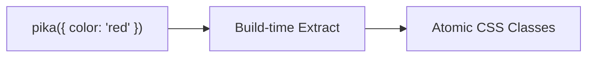

# What is PikaCSS

<!-- Section: Getting Started | Category: getting-started -->

## Key Features

### Zero Config
<!-- Explain that PikaCSS works out of the box with no configuration required -->

### Zero Runtime
<!-- Explain that all CSS is generated at build time with no runtime overhead -->

### From CSS-in-JS to Atomic CSS

<!-- Explain the transformation from CSS-in-JS syntax to atomic CSS output -->

### Cascade Ordering Conflict Resolved
<!-- Explain how PikaCSS resolves CSS cascade ordering issues -->

### Powerful Plugin System
<!-- Explain the plugin architecture and extensibility -->

### Fully Customizable
<!-- Explain the customization capabilities (selectors, shortcuts, variables, etc.) -->

## Concept

### How pika() Works
<!-- Explain the pika() function: input style definitions, output class names -->

<!-- {Template: demonstrate pika() with pikain/pikaout examples} -->

::: code-group

<<< @/.examples/getting-started/<name>.example.pikain.ts [Input]

<<< @/.examples/getting-started/<name>.example.pikaout.css [Output]

:::

### Statically Analyzable
<!-- Explain why pika() calls must be statically analyzable and what that means -->

<!-- {Template: show valid vs invalid pika() usage} -->

::: tip
<!-- Highlight what counts as statically analyzable -->
:::

::: danger
<!-- Show common mistakes that break static analysis -->
:::

### Nested Selector
<!-- Explain the nested selector system and how $ represents the current selector -->

<!-- Must cover three scenarios: $:pseudo, @media, custom selector -->

::: code-group

<<< @/.examples/getting-started/<nested-pseudo>.example.pikain.ts [$:pseudo]

<<< @/.examples/getting-started/<nested-pseudo>.example.pikaout.css [$:pseudo Output]

:::

::: code-group

<<< @/.examples/getting-started/<nested-media>.example.pikain.ts [@media]

<<< @/.examples/getting-started/<nested-media>.example.pikaout.css [@media Output]

:::

::: code-group

<<< @/.examples/getting-started/<nested-selector>.example.pikain.ts [Custom Selector]

<<< @/.examples/getting-started/<nested-selector>.example.pikaout.css [Custom Selector Output]

:::

### Cascade Ordering Conflict
<!-- Explain the shorthand/longhand CSS property conflict and how PikaCSS resolves it -->

<!-- Shorthand/longhand conflict scenarios only; unrelated to @layer -->

::: code-group

<<< @/.examples/getting-started/<cascade>.example.pikain.ts [Input]

<<< @/.examples/getting-started/<cascade>.example.pikaout.css [Output]

:::

## Next
<!-- Link to Setup page and other Getting Started pages -->
