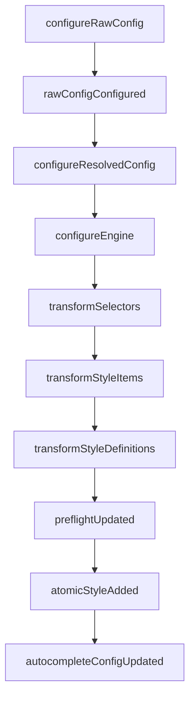

# Available Hooks

<!-- Section: Plugin Development | Category: plugin-development -->

<!-- Hook execution order diagram -->



## configureRawConfig

### Signature
<!-- async hook signature -->

### When
<!-- When this hook fires -->

### Example

::: code-group

```ts [plugin.ts]
// <!-- Show configureRawConfig usage -->
```

:::

## rawConfigConfigured

### Signature
<!-- sync hook signature -->

### When
<!-- When this hook fires -->

### Example

::: code-group

```ts [plugin.ts]
// <!-- Show rawConfigConfigured usage -->
```

:::

## configureResolvedConfig

### Signature
<!-- async hook signature -->

### When
<!-- When this hook fires -->

### Example

::: code-group

```ts [plugin.ts]
// <!-- Show configureResolvedConfig usage -->
```

:::

## configureEngine

### Signature
<!-- async hook signature -->

### When
<!-- When this hook fires -->

### Example

::: code-group

```ts [plugin.ts]
// <!-- Show configureEngine usage -->
```

:::

## transformSelectors

### Signature
<!-- async hook signature -->

### When
<!-- When this hook fires -->

### Example

::: code-group

```ts [plugin.ts]
// <!-- Show transformSelectors usage -->
```

:::

## transformStyleItems

### Signature
<!-- async hook signature -->

### When
<!-- When this hook fires -->

### Example

::: code-group

```ts [plugin.ts]
// <!-- Show transformStyleItems usage -->
```

:::

## transformStyleDefinitions

### Signature
<!-- async hook signature -->

### When
<!-- When this hook fires -->

### Example

::: code-group

```ts [plugin.ts]
// <!-- Show transformStyleDefinitions usage -->
```

:::

## preflightUpdated

### Signature
<!-- sync hook signature -->

### When
<!-- When this hook fires -->

### Example

::: code-group

```ts [plugin.ts]
// <!-- Show preflightUpdated usage -->
```

:::

## atomicStyleAdded

### Signature
<!-- sync hook signature -->

### When
<!-- When this hook fires -->

### Example

::: code-group

```ts [plugin.ts]
// <!-- Show atomicStyleAdded usage -->
```

:::

## autocompleteConfigUpdated

### Signature
<!-- sync hook signature -->

### When
<!-- When this hook fires -->

### Example

::: code-group

```ts [plugin.ts]
// <!-- Show autocompleteConfigUpdated usage -->
```

:::

## Next
<!-- Link to Type Augmentation -->
