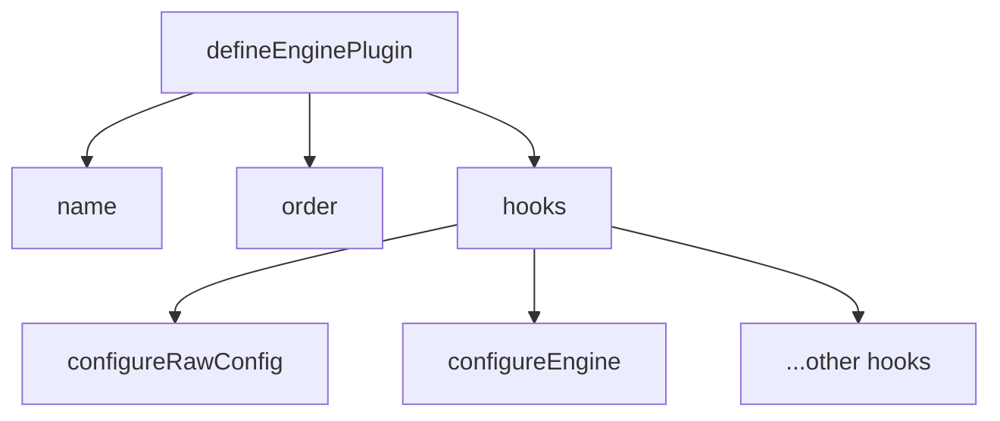

# Create a Plugin

<!-- Section: Plugin Development | Category: plugin-development -->

## Structure
<!-- Explain the basic plugin file structure and conventions -->



## defineEnginePlugin

<!-- Explain the defineEnginePlugin helper and its parameters -->

::: code-group

```ts [plugin.ts]
// <!-- Show basic plugin skeleton using defineEnginePlugin -->
```

:::

## order
<!-- Explain plugin ordering: pre, default, post -->

> [!NOTE]
> <!-- Clarify how ordering affects hook execution sequence -->

## Next
<!-- Link to Available Hooks -->
