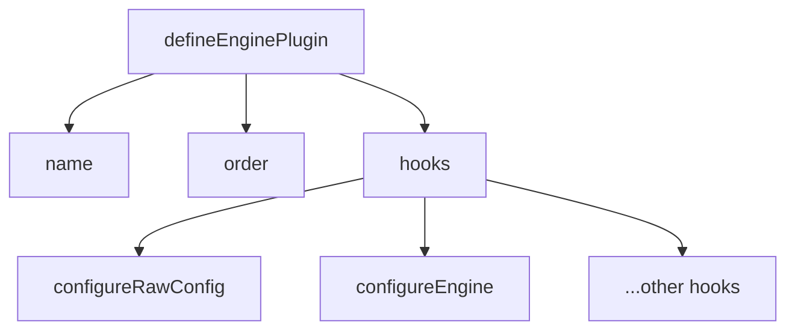

# Create a Plugin

<!-- Section: Plugin Development | Category: plugin-development -->

## Structure
<!-- Explain the basic plugin file structure and conventions -->



## defineEnginePlugin

<!-- Explain the defineEnginePlugin helper and its parameters -->

::: code-group

```ts [plugin.ts]
// <!-- Show basic plugin skeleton using defineEnginePlugin -->
```

:::

## order
<!-- Explain plugin ordering: pre, default, post; core built-ins are prepended automatically. -->

## Per-engine state
<!-- Explain that plugin factory state is per Engine instance and should not leak across engines. -->

## Lifecycle & Gotchas

### Hook errors are reported, then rethrown
<!-- Explain diagnostic delivery and error propagation. -->

### Lower semantic definitions before Engine construction
<!-- Add config-backed selectors/shortcuts/variables/keyframes in configureRawConfig; use configureEngine only for initialized-engine capabilities. -->

### Register configuration inputs during initialization
<!-- External files/directories that affect config must be registered with the initialization dependency API. -->

## Testing a Plugin
<!-- Cover direct hook/unit tests and real createEngine() end-to-end assertions. -->

## Next
<!-- Link to Available Hooks and Type Augmentation. -->
