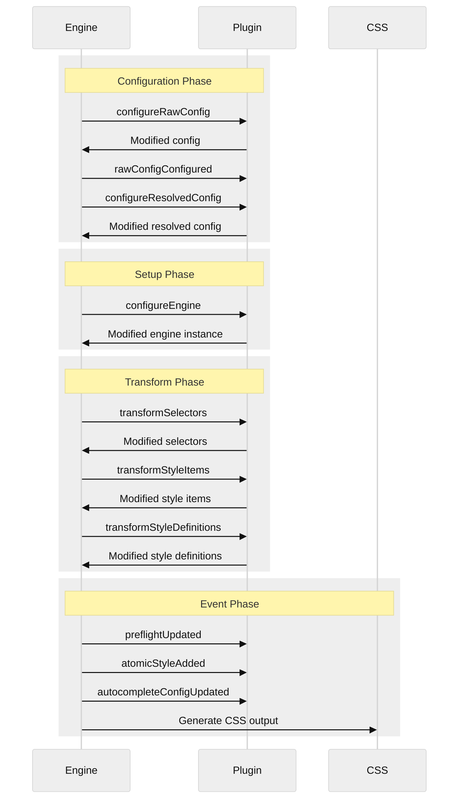

# Plugin Hooks Reference

PikaCSS provides 10 hooks that plugins can use to interact with the engine at different stages.

## Hook Lifecycle



## Configuration Phase Hooks

### `configureRawConfig`

**Type**: `async`

Modify the raw configuration before it's processed.

```typescript
async configureRawConfig(config) {
  // Add default shortcuts
  return {
    ...config,
    shortcuts: [
      ...(config.shortcuts || []),
      ['my-shortcut', { color: 'red' }]
    ]
  }
}
```

### `rawConfigConfigured`

**Type**: `sync`

Called after raw config is configured. Read-only access.

```typescript
rawConfigConfigured(config) {
  // Log or validate config
  console.log('Config loaded:', config)
}
```

### `configureResolvedConfig`

**Type**: `async`

Modify the resolved (normalized) configuration.

```typescript
async configureResolvedConfig(resolvedConfig) {
  return {
    ...resolvedConfig,
    prefix: resolvedConfig.prefix || 'pk-'
  }
}
```

## Setup Phase Hooks

### `configureEngine`

**Type**: `async`

Configure the engine instance. This is where you add shortcuts, selectors, variables, etc.

```typescript
async configureEngine(engine) {
  // Add shortcuts
  engine.shortcuts.add(
    ['btn', { padding: '10px', borderRadius: '4px' }]
  )

  // Add selectors
  engine.selectors.add(
    ['@dark', 'html.dark $']
  )

  // Add variables
  engine.variables.add({
    '--primary': '#007bff'
  })

  // Add keyframes
  engine.keyframes.add(
    ['fadeIn', { from: { opacity: 0 }, to: { opacity: 1 } }]
  )

  // Add preflight
  engine.addPreflight({
    ':root': { '--plugin-var': 'value' }
  })

  // Register for autocomplete
  engine.appendAutocompleteStyleItemStrings('btn')
  engine.appendAutocompleteSelectors('@dark')
}
```

## Transform Phase Hooks

### `transformSelectors`

**Type**: `async`

Transform selector strings before they're resolved.

```typescript
async transformSelectors(selectors) {
  return selectors.map(selector => {
    // Transform @hover to $:hover
    if (selector === '@hover') {
      return '$:hover'
    }
    return selector
  })
}
```

### `transformStyleItems`

**Type**: `async`

Transform style items before they're resolved into style definitions.

```typescript
async transformStyleItems(styleItems) {
  return styleItems.map(item => {
    if (typeof item === 'string' && item.startsWith('icon-')) {
      // Transform icon shorthand to style object
      return { '--icon': item.slice(5) }
    }
    return item
  })
}
```

### `transformStyleDefinitions`

**Type**: `async`

Transform resolved style definitions before atomization.

```typescript
async transformStyleDefinitions(defs) {
  return defs.map(def => {
    // Transform custom 'size' property
    if ('size' in def) {
      const { size, ...rest } = def
      return {
        ...rest,
        width: size,
        height: size
      }
    }
    return def
  })
}
```

## Event Phase Hooks

### `preflightUpdated`

**Type**: `sync`

Called when preflight styles are updated.

```typescript
preflightUpdated() {
  console.log('Preflight styles were updated')
}
```

### `atomicStyleAdded`

**Type**: `sync`

Called when a new atomic style is added to the engine.

```typescript
atomicStyleAdded(atomicStyle) {
  console.log('New style:', {
    id: atomicStyle.id,
    property: atomicStyle.content.property,
    value: atomicStyle.content.value
  })
}
```

### `autocompleteConfigUpdated`

**Type**: `sync`

Called when autocomplete configuration is updated.

```typescript
autocompleteConfigUpdated() {
  console.log('Autocomplete config updated')
}
```

## Hook Reference Table

| Hook | Type | Phase | Return |
|------|------|-------|--------|
| `configureRawConfig` | async | Configuration | `EngineConfig \| void` |
| `rawConfigConfigured` | sync | Configuration | `void` |
| `configureResolvedConfig` | async | Configuration | `ResolvedEngineConfig \| void` |
| `configureEngine` | async | Setup | `void` |
| `transformSelectors` | async | Transform | `string[]` |
| `transformStyleItems` | async | Transform | `ResolvedStyleItem[]` |
| `transformStyleDefinitions` | async | Transform | `ResolvedStyleDefinition[]` |
| `preflightUpdated` | sync | Event | `void` |
| `atomicStyleAdded` | sync | Event | `void` |
| `autocompleteConfigUpdated` | sync | Event | `void` |

## Engine Utility Methods

Available in `configureEngine` hook:

### Preflight Methods

```typescript
engine.addPreflight(preflight) // Add preflight styles
engine.notifyPreflightUpdated() // Trigger preflightUpdated hook
```

### Autocomplete Methods

```typescript
engine.appendAutocompleteSelectors(...selectors)
engine.appendAutocompleteStyleItemStrings(...strings)
engine.appendAutocompleteExtraProperties(...properties)
engine.appendAutocompleteExtraCssProperties(...properties)
engine.appendAutocompletePropertyValues(property, ...tsTypes)
engine.appendAutocompleteCssPropertyValues(property, ...values)
engine.notifyAutocompleteConfigUpdated()
```

### Notification Methods

```typescript
engine.notifyPreflightUpdated()
engine.notifyAtomicStyleAdded(atomicStyle)
engine.notifyAutocompleteConfigUpdated()
```

### Store Access

```typescript
engine.store.atomicStyleIds // Map<string, string> - Content hash → ID
engine.store.atomicStyles // Map<string, AtomicStyle> - ID → AtomicStyle
```
