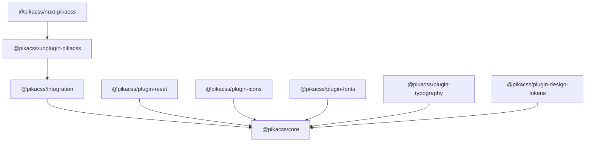

# API 參考 {#api-reference}

PikaCSS 由數個套件組成，每個套件都有專注的 API。

## 套件總覽 {#package-overview}

### 核心套件 {#core-packages}

| 套件 | 用途 |
|---------|---------|
| [`@pikacss/core`](/api/core) | 引擎基礎：`createEngine`、`defineEngineConfig`、`defineEnginePlugin`、型別 |
| [`@pikacss/integration`](/api/integration) | 建置系統橋接：`createCtx`、設定載入、原始碼轉換 |
| [`@pikacss/unplugin-pikacss`](/api/unplugin) | 通用打包工具外掛：Vite、Webpack、Rspack、esbuild、Rollup、Rolldown |
| [`@pikacss/nuxt-pikacss`](/api/nuxt) | Nuxt 模組：零設定的 Nuxt 整合 |

### 官方外掛 {#official-plugins}

| 套件 | 用途 |
|---------|---------|
| [`@pikacss/plugin-reset`](/api/plugin-reset) | CSS reset 注入 |
| [`@pikacss/plugin-icons`](/api/plugin-icons) | 透過 Iconify 的圖示 shortcut |
| [`@pikacss/plugin-fonts`](/api/plugin-fonts) | 網頁字型載入 |
| [`@pikacss/plugin-typography`](/api/plugin-typography) | 長文排版樣式 |
| [`@pikacss/plugin-design-tokens`](/api/plugin-design-tokens) | W3C design token 轉 CSS 變數 |

### 工具 {#tooling}

| 套件 | 用途 |
|---------|---------|
| [`@pikacss/eslint-config`](/api/eslint-config) | 用於靜態分析的 ESLint 規則 |

## 套件關係圖 {#package-graph}

## 下一步 {#next}

- [Core API](/api/core)：引擎函式、define 輔助函式，以及型別。
- [快速開始](/zh-tw/getting-started/what-is-pikacss)：介紹與設定。
